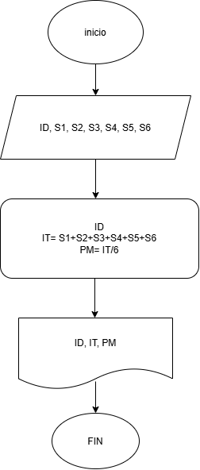
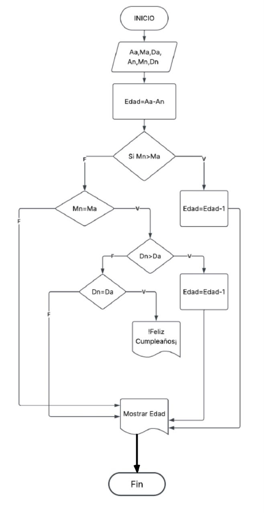
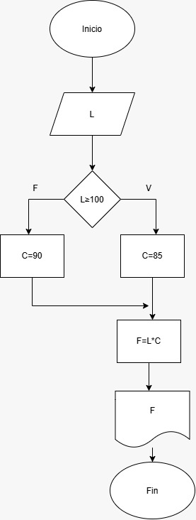
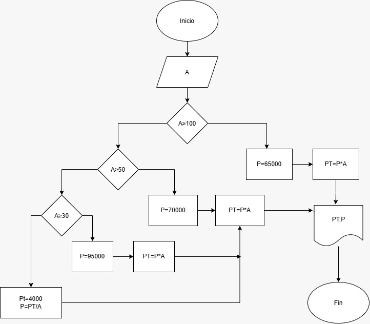

# EJERCICIOS DE CLASE DIAGRAMA DE FLUJO Y ALGORITMOS.  
## EJERCICIO 1  
crear un algoritmo que realize el ingreso total y promedio mensual de una empresa.  
### DIAGRAMA DE FLUJO.  
  
  
## EJERCICIO 2  
crear un algoritmo para saber la edad de una persona a trasves de us fecha de cumpleaños y la fecha actual.  
### DIAGRAMA DE FLUJO.  
  
  
## EJERCICIO 3  
realice un algoritmo para determinar cuanto se debe pagar por equis catidad de lapices considerando que si son 100 o mas el costo es de $85 cada uno; de lo contrario, el precio es de $90. representelo en el diagrama de flujo.  
### DIAGRAMA DE FLUJO  
  
  
## EJERCICIO 4  
el director de una escuela esta organisando un viaje de estudios, y requiere determinar cuanto debe cobrar a cada alumno y cuanto debe pagar a la compañia de viajes por el servicio. la forma de cobrar es la siguiente: si son 100 alumnos o mas, el costo por cada alumno es de $65.00; de 50 a 99 alumnos, el costo es de $70.00, de 30 a 49 sera de $95.00, y si son menos de 30, el costo de la renta del autobos es de 4000.00, sin importar el numero de alumnos.  
  

