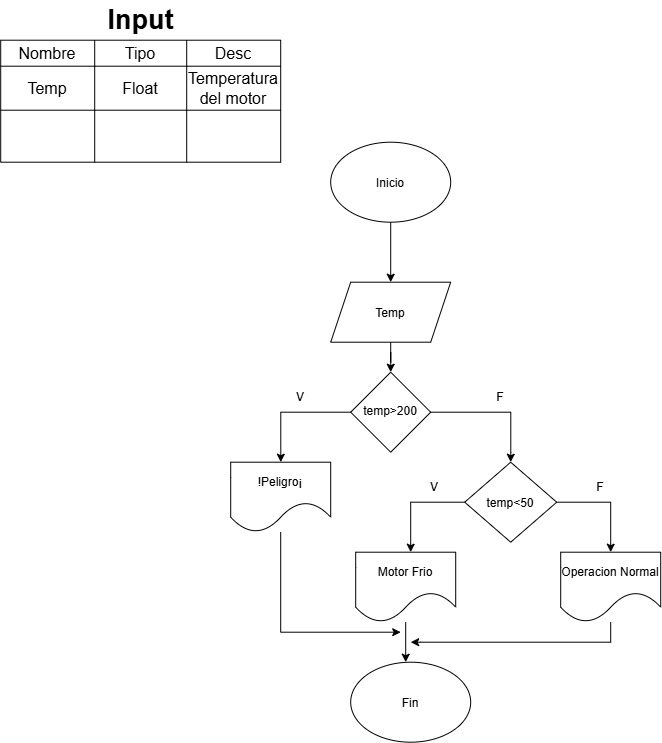
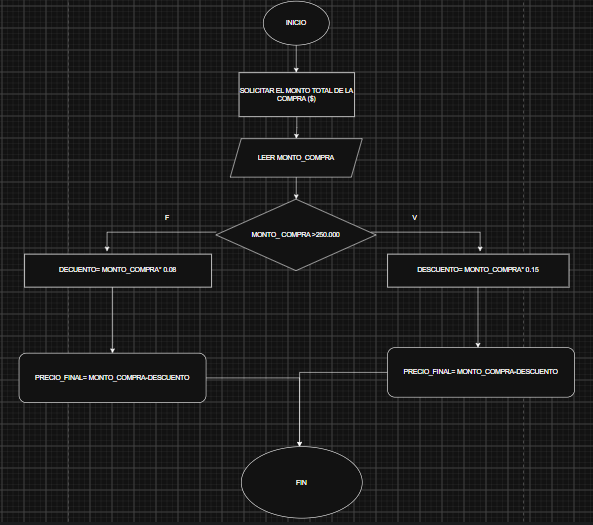
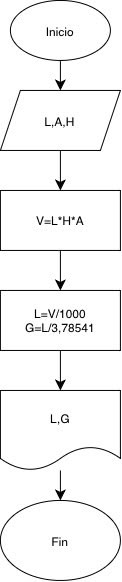

# EJERCICIOS DE CLASE DIAGRAMA DE FLUJO Y ALGORITMOS.  
## EJERCICIO 1  
crear un algoritmo que realize el ingreso total y promedio mensual de una empresa.  
### 💼DIAGRAMA DE FLUJO 💼
  
  
## EJERCICIO 2  
crear un algoritmo para saber la edad de una persona a trasves de us fecha de cumpleaños y la fecha actual.  
### DIAGRAMA DE FLUJO.  
  
  
## EJERCICIO 3  
realice un algoritmo para determinar cuanto se debe pagar por equis catidad de lapices considerando que si son 100 o mas el costo es de $85 cada uno; de lo contrario, el precio es de $90. representelo en el diagrama de flujo.  
### ✏️✏️DIAGRAMA DE FLUJO✏️✏️  
  
  
## EJERCICIO 4  
el director de una escuela esta organisando un viaje de estudios, y requiere determinar cuanto debe cobrar a cada alumno y cuanto debe pagar a la compañia de viajes por el servicio. la forma de cobrar es la siguiente: si son 100 alumnos o mas, el costo por cada alumno es de $65.00; de 50 a 99 alumnos, el costo es de $70.00, de 30 a 49 sera de $95.00, y si son menos de 30, el costo de la renta del autobos es de 4000.00, sin importar el numero de alumnos.  
## 🚐🚐DIAGRAMA DE FLUJO🚐🚐
  
  
## EJERCICIO 5  
**control de temperatura de motor**  
durante una inspeccion de rutina, se mide la temperatura de un motor. si la temperatura es mayor a un valorcritico, debe indicar ¨peligro: sobrecalentameniento¨. si esta dentro del rango seguro, indicar ¨Operacion normal¨. si es demaciado baja, indicar ¨motor frio-calentar antes de operar¨  
### DIAGRAMA DE FLUJO  
  
  
## 🛩️🛩️ EJERCICIO 6 🛩️🛩️  
un sistema debe registrar la altitud de vuelo cada 10 minutos durante una hora y mostrar todas las mediciones al final.   
**En Pseudocodigo**  
Inicio  
cont=0  
leer nivel  
Mientras nivel ≥ max*0.1  
cont=cont+1  
leer nivel  
fin mientras  
mostrar "Tiempo trasmitido" cont  
fin  
  
## EJERCICIO 7  
un sistema que mide 5 minutos la temoeratura en cabina durante una hora. si en algun momento se dectecta un temoeratura mayor a 27°c o menor a 18°c, se debe indicar qie se active el sistema de climatizacion.  
  
**En Pseudocodigo**  
Inicio  
cont=0  
leer temp  
miestras cont<12  
Si temp>27 o temp<12  
mostrar "activar climatizacion"  
Fin si cont=cont+1  
fin mientras  
fin  
  
  
## EJERCICIO 8  
Un almacen de ropa tiene una promocion: por comprar superiores a $250.000 se les aplicara un descuento de 15%, de lo contrario, solo se aplicara un 8% de descuento.realicar un algoritmo para determinar el precio final que debe pagar una persona por comprar en dicho almacen.  
### DIAGRAMA DE FLUJO  
  
  
## EJERCICIO 9  
Un usuario necesita determinar cuantos litros o galones de agua caben en un acuario, pero solo dispone de una cinta metrica "en centimetro". diseña un algoritmo para solucionar el problema.  
### 🐠🐠🐠DIAGRAMA DE FLUJO🐠🐠🐠  
  
  
# RESPONDER LAS SIGUIENTES PREGUNTAS SI CORRESPONDE O NO CON LAS DEFINICIONES O CONCEPTOS APRENDIDOS EN CLASE.  
  
  
## PARTE 1: Identificar Algoritmos.  
  
### 1. UNA PAGINA WED.  
NO. porque una pagina web es un producto o un conjunto de datos/archivos que se renderizan visualemnte.  
  
### 2. una receta para hacer un partel, donde se indican ingredientes y pasos a seguir.  
SI. porque cumple con las caracteristicas fundamentales: los ingredientes reprecentan los datos de entrada, las instruciones estructuradas en orden logico son el procesamiento, y el pastel el resultado final "salida".  
  
### 3. piensa en un numero y multiplicalo por otro.  
NO. porque es un enunciado ambiguo e imcompleto. le falta precicion y un criterio mas claro.  
  
### 4. un manual de instruciones para ar,ar un mueble, con pasos detallados y un orden claro.  
SI. porque contiene una secuencia finita, logica y determinante pasos ordenados.  
  
### 5. una lista de compras organizada en orden alfabetico.  
NO. porque es una estructura de datos o un conjuntos organizado de informacion static. no contiene secuencias ni pasos ejecutables.  
  
## PARTE 2: Variables y constantes.  
  
### 1. el valor de la gravedad en la tierra, 9.8m/s  
COSTANTE: porque el valor dado de la gravedad de la tierra es un valor fijo y predeterminado dentro del comtexto de calculo.  
  
### 2. la edad de una persona calculada con base en el año actual y su año de nacimiento.  
VARIABLE: porque cambia a medida que trascurre el tiempo "el año actual aumenta".  
  
### 3. la cantidad de dinero en una cuenta bancaria.  
VARIABLE: porque puede aumentar o disminuir con depositos o retiros de la cuenta.  
  
### 4. la velocidad de la luz en el vacio, 299,792,458 m/s  
COSTANTE: porque su valor exacto en el vacio no cambia.  
  
### 5. el radio de un circulo.  
VARIABLE: porque depende de las dimenciones del circulo en cuention; no tiene un valor fijo.  

